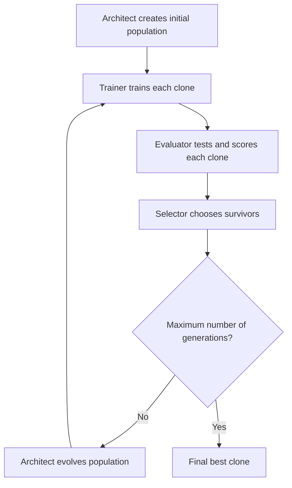

# 🧬 Clone Master – An AGI that Evolves AGIs

<div align="center">
  
  
  
  
</div>

<p align="center">
  <i>An evolutionary system that allows AIs to create, train, and evolve new AIs without direct human intervention</i>
</p>


## 📋 Table of Contents

- [Overview](#-overview)
- [Features](#-features)
- [Agent Architecture](#-agent-architecture)
- [Workflow](#-workflow)
- [Initial AGI Task](#-initial-agi-task)
- [Installation](#-installation)
- [Usage](#-usage)
  - [Graphical Interface (Streamlit)](#graphical-interface-streamlit)
  - [Command Line](#command-line)
- [Project Structure](#-project-structure)
- [Results and Visualizations](#-results-and-visualizations)
- [Examples](#-examples)
- [Troubleshooting](#-troubleshooting)
- [FAQ](#-faq)
- [Roadmap](#-roadmap)
- [Contributing](#-contributing)
- [License](#-license)
- [Team](#-team)

## 📘 Overview

**Clone Master** is a **multi-agent AGI system** designed to create, train, evaluate, and evolve specialized artificial intelligences **without direct human intervention**.

Inspired by principles of natural evolution, genetic algorithms, and systems engineering, the project implements an architecture where autonomous agents work in cycles to generate "clones" (AI models) increasingly capable of solving specific tasks.

> 💡 **Core Idea:** The best AIs are not just created, but naturally evolve through generations of experimentation, evaluation, and selection.

## 🌟 Features

- **Autonomous Evolution**: System that creates and evolves AIs through mutation, recombination, and selection
- **Interactive Web Interface**: Visualize and interact with the evolution process via Streamlit
- **Objective Evaluation**: Clear metrics to compare the performance of generated AIs
- **Interchangeable Models**: Extensible architecture that supports different types of algorithms
- **Advanced Visualizations**: Graphs, genealogy trees, and real-time statistics
- **Reproducibility**: Control the evolutionary process with defined random seeds

## 🧠 Agent Architecture

The system is composed of four main agents that work together in an evolutionary cycle:

### 🏗️ 1. Intelligence Architect
Responsible for designing new AIs ("clones"), defining their structure, hyperparameters, and base algorithms. The Architect implements:
- Generation of first-generation clones with random configurations
- Mutation of existing clones to experiment with new parameters
- Recombination (crossover) between successful clones to inherit favorable characteristics

### 🎓 2. Skills Trainer
Trains each newly created AI with data, executing:
- Preparation of suitable training sets for each clone
- Parameter adjustment during training
- Application of techniques such as early stopping and validation splits
- Storage of trained models

### 📊 3. Performance Evaluator
Tests each AI in controlled scenarios, performing:
- Evaluation on independent test datasets
- Calculation of relevant metrics (precision, recall, F1, etc.)
- Analysis of strengths and weaknesses of each clone
- Ranking of clones by performance

### 🧬 4. Evolutionary Selector
Decides the fate of each clone based on its performance:
- **Elitism**: Keeps the best clones intact for the next generation
- **Selection**: Chooses which clones will be parents of the next generation
- **Mutation**: Introduces random variations in promising clones
- **Crossover**: Combines characteristics of successful clones
- **Discard**: Removes low-performing clones

## 🔁 Workflow



1. The Architect creates the initial population of clones
2. The Trainer trains each clone with representative data
3. The Evaluator tests each clone and assigns scores
4. The Selector chooses which clones will survive and evolve
5. The cycle repeats until reaching the maximum number of generations
6. The best clone of the last generation is selected as the final result

## 🧪 Initial AGI Task

For this initial version, Clone Master creates AIs specialized in:

> **Binary sentiment classification: identifying texts as "positive" or "negative".**

This problem was chosen because:
- It is simple to understand, but sufficiently complex to demonstrate evolution
- It allows testing different algorithms and text representations
- There is abundant data for training and evaluation
- Performance can be measured objectively

## 📥 Installation

### Prerequisites

- Python 3.9 or higher
- Pip (Python package manager)
- 4GB+ of RAM recommended

### Installation via virtual environment (recommended)

```bash
# Clone the repository
git clone https://github.com/your-username/clone-master.git
cd clone-master

# Create a virtual environment
python -m venv master_venv

# Activate the virtual environment
# On Windows:
master_venv\Scripts\activate
# On macOS/Linux:
source master_venv/bin/activate

# Install dependencies
pip install -r mestre_dos_clones/requirements.txt
```

### Installation verification

To verify if the installation was successful:

```bash
python -c "import numpy, pandas, scikit_learn, streamlit; print('Installation successful!')"
```

## 🚀 Usage

### Graphical Interface (Streamlit)

The easiest way to interact with Clone Master is through the Streamlit web interface.

```bash
# Activate the virtual environment (if needed)
source master_venv/bin/activate  # Linux/macOS
# or
master_venv\Scripts\activate  # Windows

# Start the Streamlit application
python -m streamlit run mestre_dos_clones/app.py
```

This will automatically open a page in your browser at http://localhost:8501.

The interface allows:

- **Home**: Project overview and quick tutorial
- **Run Evolution**: Configure and start the evolutionary process
- **View Results**: Explore statistics and graphs
- **Test Clones**: Try the clones with your own texts
- **Settings**: Customize the experience
- **About**: Detailed information about the project

### Command Line

To run the evolutionary cycle via command line:

```bash
# Activate the virtual environment (if needed)
source master_venv/bin/activate  # Linux/macOS
# or
master_venv\Scripts\activate  # Windows

# Run the evolutionary cycle
python -m mestre_dos_clones.main --generations 10 --population 20 --seed 42
```

#### Available parameters:

| Parameter | Description | Default |
|-----------|-------------|---------|
| `--generations` | Number of generations to evolve | 10 |
| `--population` | Population size per generation | 20 |
| `--data` | Path to custom data file | None (uses synthetic data) |
| `--seed` | Random seed for reproducibility | 42 |
| `--output` | Output directory for results | "output/" |

## 📂 Project Structure

```
mestre_dos_clones/
├── agents/                 # Implementation of system agents
│   ├── architect.py        # Creates and evolves clones
│   ├── evaluator.py        # Evaluates clone performance
│   ├── selector.py         # Selects clones for evolution
│   ├── trainer.py          # Trains clones with data
│   └── __init__.py         # Package initialization
├── clones/                 # Clone definitions and implementations
│   ├── adaptive_clone.py   # Adaptive implementation
│   ├── base_clone.py       # Base class for all clones
│   ├── clustering_clone.py # Implementation for clustering tasks
│   ├── dimension_clone.py  # Implementation for dimensionality reduction
│   ├── meta_clone.py       # Meta-learning implementation
│   ├── regression_clone.py # Implementation for regression tasks
│   ├── sentiment_clone.py  # Implementation for sentiment analysis
│   ├── __init__.py         # Package initialization
│   └── generated/          # Generated clones directory
├── data/                   # Data for training and testing
│   └── dataset.txt         # Example dataset
├── utils/                  # Tools and utilities
│   ├── diversity_metrics.py # Diversity measurement tools
│   ├── evolutionary_islands.py # Island model implementation
│   ├── visualization.py    # Visualization tools
│   └── __init__.py         # Package initialization
├── app.py                  # Streamlit interface
├── cli.py                  # Command line interface
├── features.py             # Features implementation
├── main.py                 # Runs the evolutionary cycle
├── run_app.py              # Script to start the web interface
├── __init__.py             # Package initialization
└── requirements.txt        # Project dependencies
```

## 📊 Results and Visualizations

After running the evolutionary cycle, the results are stored in:

```
output/
├── clones/                        # Clones saved by generation
│   ├── generation_1/
│   ├── generation_2/
│   └── ...
├── results/                       # Results of the evolutionary process
│   └── evolution_history.json     # Complete evolution history
└── visualizations/                # Generated visualizations
    ├── evolution_progress.png     # Evolution progress graph
    ├── genealogy_tree.png         # Clone genealogy tree
    └── confusion_matrix.png       # Confusion matrix of the best clone
```

### Visualization Examples


## 🔍 Examples

### Example 1: Simple Classification

```python
# Load the best clone from the latest generation
from mestre_dos_clones.utils.loader import load_best_clone
clone = load_best_clone()

# Use it to classify text
text = "I really enjoyed this product, it exceeded my expectations!"
result = clone.predict([text])[0]
print("Sentiment:", "Positive" if result == 1 else "Negative")
```

### Example 2: Comparative Analysis

```python
# Compare two clones from different generations
from mestre_dos_clones.utils.loader import load_clone_by_id
clone1 = load_clone_by_id("generation_1", "Genesis-1")
clone2 = load_clone_by_id("generation_10", "Evolved-493")

# Test on the same texts
texts = [
    "The service was terrible and slow.",
    "This is the best purchase I've made in years!",
    "The quality is average, nothing special."
]

# Compare predictions
for text in texts:
    pred1 = "Positive" if clone1.predict([text])[0] == 1 else "Negative"
    pred2 = "Positive" if clone2.predict([text])[0] == 1 else "Negative"
    print(f"Text: {text}")
    print(f"Gen1 Clone: {pred1}, Gen10 Clone: {pred2}")
```

## ❓ Troubleshooting

### Common Issues

1. **"ModuleNotFoundError: No module named 'mestre_dos_clones'"**
   - Ensure your PYTHONPATH includes the project directory
   - Run from the project root directory

2. **Memory issues during evolution**
   - Reduce population size or number of generations
   - Close other memory-intensive applications

3. **Slow training on large datasets**
   - Use a smaller subset for initial experiments
   - Enable multiprocessing if available

### Debugging

Set the environment variable `MESTRE_DEBUG=1` to enable detailed logs:

```bash
# On Linux/macOS
export MESTRE_DEBUG=1

# On Windows (PowerShell)
$env:MESTRE_DEBUG=1
```

## ❔ FAQ

**Q: How does evolution improve the models?**
A: Through a combination of selection (favoring better-performing clones), mutation (introducing random variations), and crossover (combining characteristics of successful clones). This process mimics natural evolution.

**Q: Can I use my own dataset?**
A: Yes, provide a custom dataset via the `--data` parameter. The file should be tab-separated with text in the first column and label (0 or 1) in the second.

**Q: What algorithms are used by the clones?**
A: Initially, clones can use different machine learning algorithms such as Naive Bayes, Logistic Regression, SVM, and Random Forest. The system will discover which works best for your specific data.

**Q: Can I extend the system for other tasks?**
A: Yes, the architecture is designed to be extensible. Create new clone types that inherit from the base class and implement the required methods for your task.

## 🛣️ Roadmap

- **Short-term**
  - Support for multi-class classification
  - Enhanced visualization tools
  - Parallel evolution of multiple populations

- **Medium-term**
  - Support for deep learning models
  - Integration with external data sources
  - Advanced hyper-parameter tuning

- **Long-term**
  - Self-evolving agent architecture
  - Federated learning across multiple instances
  - New task domains (image, audio, etc.)

## 💡 Contributing

Contributions are welcome! To contribute:

1. Fork the repository
2. Create a new branch (`git checkout -b feature/amazing-feature`)
3. Make your changes
4. Run tests (`python -m unittest discover`)
5. Commit your changes (`git commit -m 'Add some amazing feature'`)
6. Push to the branch (`git push origin feature/amazing-feature`)
7. Open a Pull Request

Please read [CONTRIBUTING.md](CONTRIBUTING.md) for detailed guidelines.

## 📄 License

This project is licensed under the MIT License - see the [LICENSE](LICENSE) file for details.

## 👥 Team

- Project Lead: [gregorizeidler](https://github.com/gregorizeidler)


---

